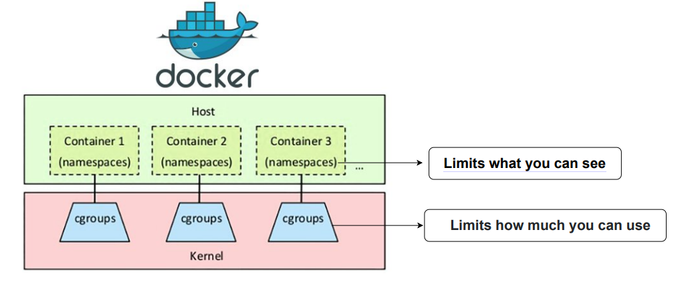
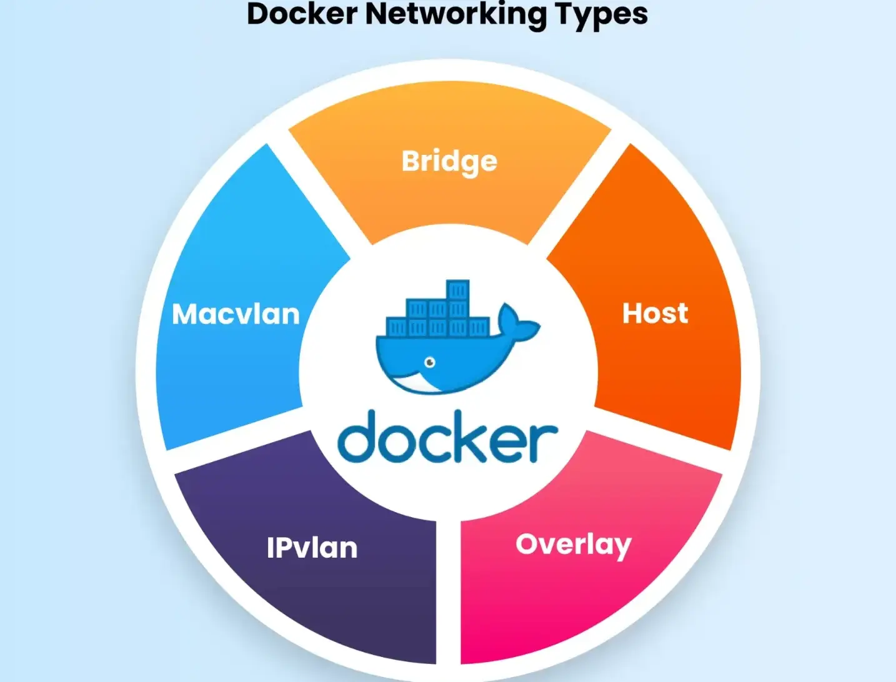
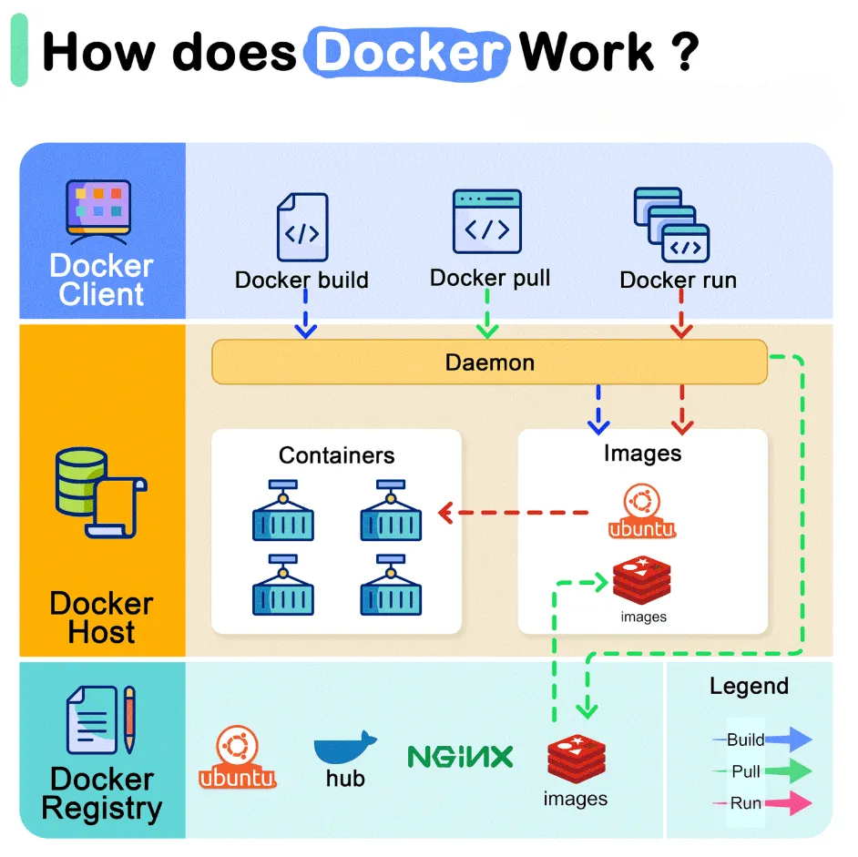
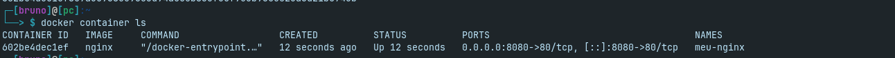
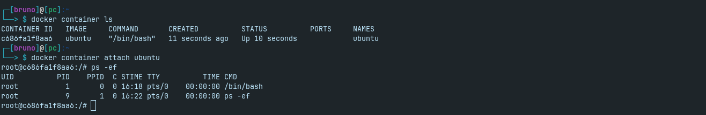
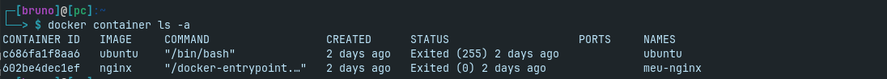
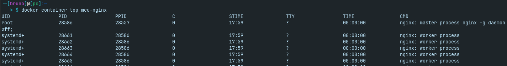

# Docker - Guia introdutório
Este repositório contém informações, resumos e exemplos para ajudar a entender conceitos fundamentais do Docker, incluindo contêineres, o que é o Docker, UFS (Union File System), volumes, networks, Dockerfile e Docker Compose.
<hr>

### Principais conceitos
**Container:** É uma instância em execução de uma imagem, ele fornece um ambiente isolado para a aplicação, garantindo que ela rode da mesma forma em qualquer lugar, ou seja, container é uma tecnologia de virtualização leve usada principalmente para empacotar e isolar aplicativos e suas dependências em um ambiente separado.
Diferentemente de uma máquina virtual, os contêineres compartilham o mesmo kernel do sistema operacional do host, tornando-se mais leves e rápidos.

<p>
    
</p>

**Namespaces:** É um recurso do kernel que possibilita criar ambientes isolados para processos, garantindo que cada contêiner tenha sua própria visão do sistema, como PID, rede e sistema de arquivos. Isso permite que diferentes contêineres operem independentemente uns dos outros.

**Cgroups** Os Control Groups (Cgroups) regulam os recursos do sistema (CPU, memória, disco, rede) que cada contêiner pod utilizar. Dessa forma, evitam que um contêiner consuma todos os recursos do host.

* *Observação:* Juntos, os namespaces garantem o isolamento, enquanto os cgroups controlam a alocação de recursos, permitindo que o Docker e outras tecnologias de contêineres operem de forma eficiente e segura.

<p>
    
</p>

**Imagem:** Uma imagem é um pacote contendo tudo o que uma aplicação precisa para ser executada, como código-fonte, dependências, bibliotecas e configurações. As imagens são imutáveis e servem como modelo para criar contêineres.

**Registry:** É um repositório onde as imagens são armazenadas e distribuídas. O mais conhecido é o Docker Hub, mas também existem registries privados, como o Amazon ECR e o Google Container Registry.
[Docker HUB](https://hub.docker.com/)

**Volumes:** Os volumes permitem persistência de dados em um contêiner. Eles são armazenados no sistema de arquivos do host e podem ser compartilhados entre múltiplos contêineres, são bastante úteis porquê, por padrão, os dados dentro de um container são descartados quando ele é destruído.

**Redes:** O docker oferece diferentes opções de rede para permitir a comunicação entre contêineres:
* **bridge:** É a rede padrão, permite que os contêineres se comuniquem dentro do mesmo host.
* **host:** O contêiner compartilha a pilha de rede do host.
* **none:** O contêiner não possui acesso à rede.
* **overlay:** É utilizado em ambientes distribuídos para comunicação entre múltiplos hosts.

<p>
    
</p>
<hr>

### Docker
O Docker é uma plataforma de virtualização de código aberto que permite a criação, o empacotamento e a distribuição de aplicações em contêineres, proporcionando um ambiente isolado e consistente para executar aplicações independentemente da infraestrutura subjacente.

Com Docker, os desenvolvedores podem criar imagens de contêineres que incluem o código da aplicação, suas dependências e as configurações necessárias para execução. Essas imagens podem ser distribuídas e executadas em qualquer sistema que tenha o Docker instalado, garantindo que a aplicação funcione da mesma maneira em diferentes ambientes.
* [**Site oficial do docker**](https://docker.com/)

**História do Docker**
O Docker foi criado pela empresa dotCloud em 2013 como um projeto interno para facilitar o gerenciamento de aplicações em seus servidores. No mesmo ano, o projeto foi tornado open source, revolucionando a maneira como as aplicações eram desenvolvidas e implantadas.

O conceito de contêineres já existia antes do Docker, com tecnologias como LXC (Linux Containers) e chroot, mas o Docker tornou o processo de criação e gerenciamento de contêineres muito mais acessível e eficiente. Com o tempo, grandes empresas como Google, Microsoft e Amazon passaram a adotar e oferecer suporte ao Docker em suas infraestruturas de nuvem.

Em 2015, a empresa dotCloud mudou seu nome para Docker Inc., e o projeto cresceu rapidamente. Em 2017, a Cloud Native Computing Foundation (CNCF) começou a supervisionar alguns projetos relacionados a contêineres, incluindo o Kubernetes, que se tornou um dos principais orquestradores para aplicações baseadas em Docker.

**Como o Docker funciona ?**
Docker utiliza a tecnologia de contêineres para isolar aplicações e seus ambientes de execução. Diferente das máquinas virtuais, que virtualizam todo um sistema operacional, os contêineres compartilham o kernel do sistema operacional do host e apenas isolam processos e dependências, tornando-os mais leves e eficientes.

A estrutura básica do Docker é composta por:

* **Docker Engine:** Responsável pela criação e execução dos contêineres.
* **Docker Images:** Modelos prontos para a criação de contêineres.
* **Docker Containers:** Instâncias executáveis de uma imagem.
* **Docker Registry:** Repositório onde as imagens são armazenadas e distribuídas.

<p>
    
</p>

**O que é o UFS (Union File System) ?**
O Union File System (UFS) é o sistema de arquivos em camadas usado pelo Docker para gerenciar imagens e containeres. Ele permite combinar várias camadas de arquivos em um único sistema de arquivos.

* Imagens: São compostas por camadas de leitura
* Containeres: Adicionam uma camada de escrita no topo das camadas de imagem.

**Instalação**
Para nosso estudo vamos instalar o docker engine.
*Observação:* Estou utilizando Linux em meu ambiente, mas caso esteja utilizando outro sistema você pode consultar a documentação no site oficial.

```bash
curl -fsSl https://get.docker.com | bash
```

Verificando a instalação do docker
```bash
docker --version
```

**Exemplo:** Criando o nosso primeiro contêiner.
```bash
docker container run -d -p 8080:80 --name meu-nginx nginx
```
Um contêiner chamado meu-nginx foi criado contendo a imagem oficial do servidor web Nginx.
📌**Explicando o comando:**
* -d: Executa o container em segundo plano, como um daemon.
* -p 8080:80: Mapeia a porta 80 do container para a porta 8080 do host.
* --name: Nomeia o container como meu-nginx.

Para acessar o container abra o seu navegador e entre no endereço http://localhost:8080

Para listar os contêineres criados e seu status.
```bash
docker container ls
```
<p>
    
</p>

📌A saída do comando é uma tabela com as seguintes colunas:

* **CONTAINER ID:** Um identificador único para o contêiner.
* **IMAGE:** A imagem Docker usada para criar o contêiner (neste caso, nginx).
* **COMMAND:** O comando que está sendo executado dentro do contêiner ("/docker-entrypoint...").
* **CREATED:** Há quanto tempo o contêiner foi criado (12 seconds ago).
* **STATUS:** O status atual do contêiner (Up 12 seconds).
* **PORTS:** As portas que estão sendo mapeadas do contêiner para o host.
0.0.0.0:8080->80/tcp significa que a porta 80 do contêiner está mapeada para a porta 8080 do host.
[::]:8088->80/tcp é semelhante, mas para conexões IPv6.
* **NAMES:** O nome atribuído ao contêiner (meu-nginx).


**Exemplo:** Suponhamos que temos um contêiner rodando a imagem do ubuntu e que queremos acessar o terminal desse contêiner.
```bash
docker container attach ubuntu
```
<p>
    
</p>


**Exemplo:** Podemos parar a execução de um container
```bash
docker container stop container_name
```
<p>
    
</p>

E**Exemplo:** Exibe estatísticas em tempo real sobre o uso de recursos dos contêineres em execução.
```bash
docker container stats
```

<p>
    
</p>

📌Obs: saída do comando docker stats exibe estatísticas em tempo real sobre o uso de recursos dos contêineres em execução. Vamos analisar cada coluna:

Coluna	                        Descrição
CONTAINER ID	                ID único do contêiner em execução.
NAME	                        Nome atribuído ao contêiner.
CPU %	                        Uso da CPU pelo contêiner em relação ao total disponível no host.
MEM USAGE / LIMIT	            Memória usada pelo contêiner e o limite configurado.
MEM %	                        Percentual de memória usada em relação ao limite.
NET I/O	                        Quantidade de dados enviados e recebidos pelo contêiner na rede.
BLOCK I/O	                    Quantidade de dados lidos e escritos em disco pelo contêiner.
PIDS	                        Número de processos ativos dentro do contêiner.

**Exemplo:** Exibe a lista de processos em execução dentro do contêiner chamado meu-nginx.
```bash
docker container top meu-nginx
```

<p>
    
</p>

<hr>

**Falta adicionar**

DockerFile
DockerCompose
Distroless
Análise de vulnerabilidades
Assinando uma imagem.


<hr>

### Conclusão

Docker revolucionou o mundo da tecnologia ao tornar a implantação de aplicações mais eficiente e previsível. Com o conhecimento abordado neste guia, você pode começar a trabalhar com Docker e explorar mais recursos avançados, como orquestração com Kubernetes e CI/CD.

Se quiser aprofundar mais no assunto, confira a [documentação oficial](https://docs.docker.com)